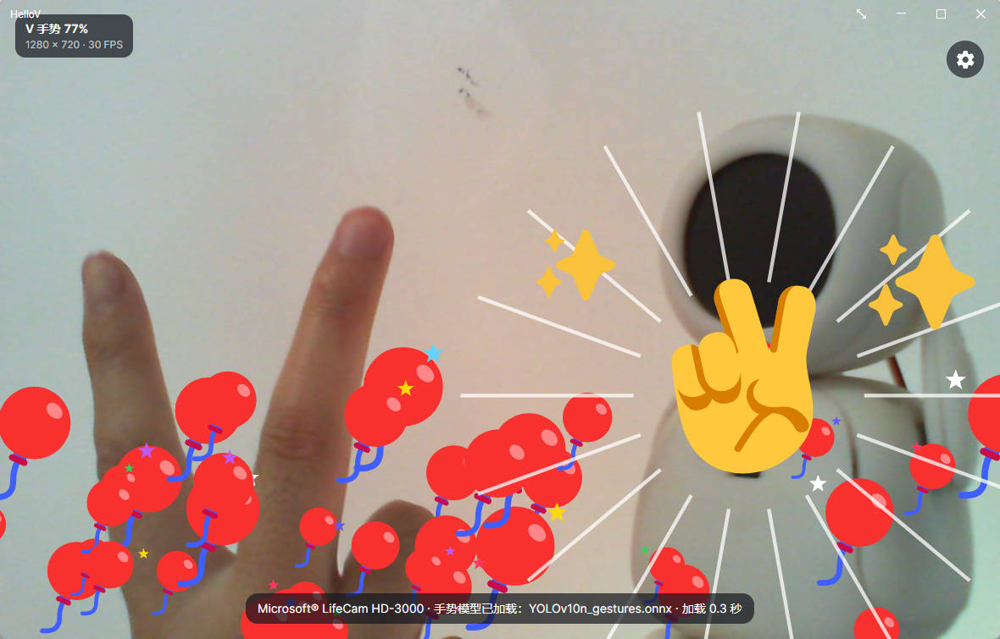
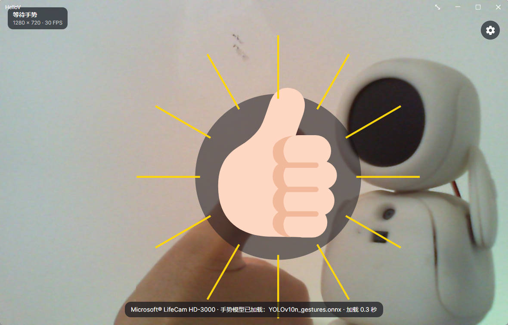

# HelloV

<p align="center">
  <strong>English</strong> · <a href="README.zh-CN.md">简体中文</a>
</p>

HelloV is a playful, real-time gesture recognition app powered by HaGRIDv2 and YOLOv10. Point a camera at your hands and turn 33 supported gestures into responsive, full-screen visual effects.

## Screenshots

| V sign · Balloons | Like · Thumbs up |
| --- | --- |
|  |  |

## Highlights

- Recognizes 33 HaGRIDv2 gestures in real time with a YOLOv10 ONNX model.
- Gives every gesture its own animation, with extra two-hand effects: fireworks, rain, confetti, and lasers.
- Runs on Windows, Linux, macOS, Android, iOS, and in WebAssembly-enabled browsers from one Avalonia codebase.
- Performs inference locally with ONNX Runtime on native platforms and ONNX Runtime Web in the browser.
- Includes camera selection, front/rear camera switching, mirror correction, full-screen mode, and an interrupt mode for immediate effect changes.
- Ships with English and Simplified Chinese UI packs and supports additional JSON language packs.
- Provides an animation preview panel, so effects can be tested without performing gestures.

## Supported targets

| Target | Project | Notes |
| --- | --- | --- |
| Windows / Linux / macOS | `HelloV.Desktop` | Desktop camera capture through OpenCV |
| Browser | `HelloV.Browser` | WebAssembly app; camera permission is required |
| Android 8.0+ | `HelloV.Android` | CameraX-based front and rear camera support |
| iOS 15.0+ | `HelloV.iOS` | Build and signing require macOS and Xcode |

## Getting started

### Requirements

- [.NET 10 SDK](https://dotnet.microsoft.com/download/dotnet/10.0)
- A camera
- The appropriate .NET Android or iOS workload when building a mobile target

The lightweight `Models/YOLOv10n_gestures.onnx` model is already included in the repository and is copied into the relevant app package during the build.

### Run the desktop app

```powershell
dotnet restore HelloV.sln
dotnet run --project src/HelloV.Desktop/HelloV.Desktop.csproj
```

### Run the browser app

```powershell
dotnet run --project src/HelloV.Browser/HelloV.Browser.csproj
```

Allow camera access when prompted. For non-local deployments, serve the published browser app over HTTPS so the browser can expose the camera API.

### Build mobile apps

```powershell
dotnet build src/HelloV.Android/HelloV.Android.csproj -c Release
dotnet build src/HelloV.iOS/HelloV.iOS.csproj -c Release
```

## Publishing

On Windows, launch the interactive publisher:

```powershell
.\one-click-publish.cmd
```

Or select a target directly:

```powershell
.\scripts\one-click-publish.ps1 -Target desktop -Configuration Release -Version 1.0.0
```

On Linux or macOS, publish a specific runtime with the shell script:

```bash
./scripts/publish-platform.sh linux-x64 Release 1.0.0
```

Packages are written to `artifacts/`. Available targets include Windows, Linux, macOS, browser, Android, and iOS variants; mobile publishing additionally requires the corresponding platform toolchain.

## Project structure

```text
HelloV/
├── Models/                 # Shared YOLOv10 ONNX gesture model
├── screenshots/            # README screenshots
├── scripts/                # Model preparation and publishing scripts
└── src/
    ├── HelloV.Core/        # Shared UI, recognition, localization, and effects
    ├── HelloV.Desktop/     # Windows, Linux, and macOS host
    ├── HelloV.Browser/     # WebAssembly host
    ├── HelloV.Android/     # Android host
    └── HelloV.iOS/         # iOS host
```

## License

HelloV is released under the [MIT License](LICENSE).
